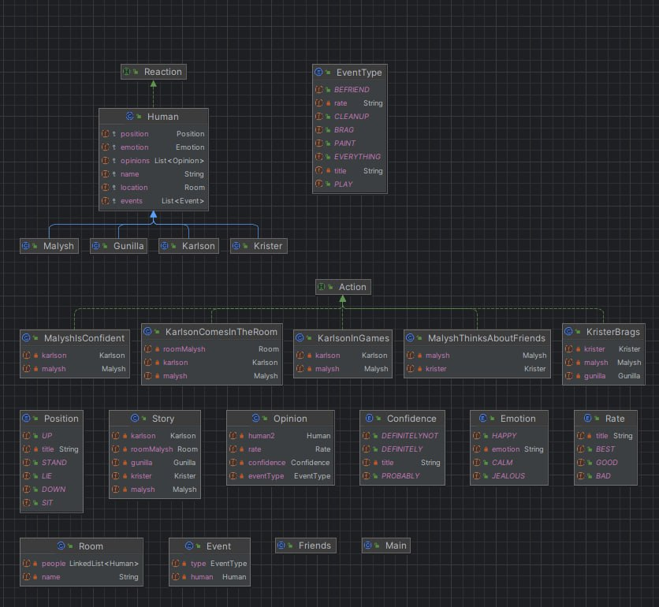

# **Лабораторная работа №3**

**Описание предметной области, по которой должна быть построена объектная модель:**

Малыш вскочил на ноги и стоял, не помня себя от восторга: так он был рад, что Карлсон вернулся. Малыш не сомневался, что Карлсон во всем "лучший в мире". И уж наверняка он самый лучший в мире товарищ по играм. В этом Малыш убедился на собственном опыте... Правда, Кристер, и Гунилла тоже хорошие товарищи, но им далеко до Карлсона, который живет на крыше! Кристер только и делает, что хвалится своей собакой Еффой, и Малыш ему давно завидует.

**Программа должна удовлетворять следующим требованиям:**

1. Доработанная модель должна соответствовать принципам SOLID.  
2. Программа должна содержать как минимум два интерфейса и один абстрактный класс (номенклатура должна быть согласована с преподавателем).  
3. В разработанных классах должны быть переопределены методы equals(), toString() и hashCode().  
4. Программа должна содержать как минимум один перечисляемый тип (enum).  

**Диаграмма классов:**

